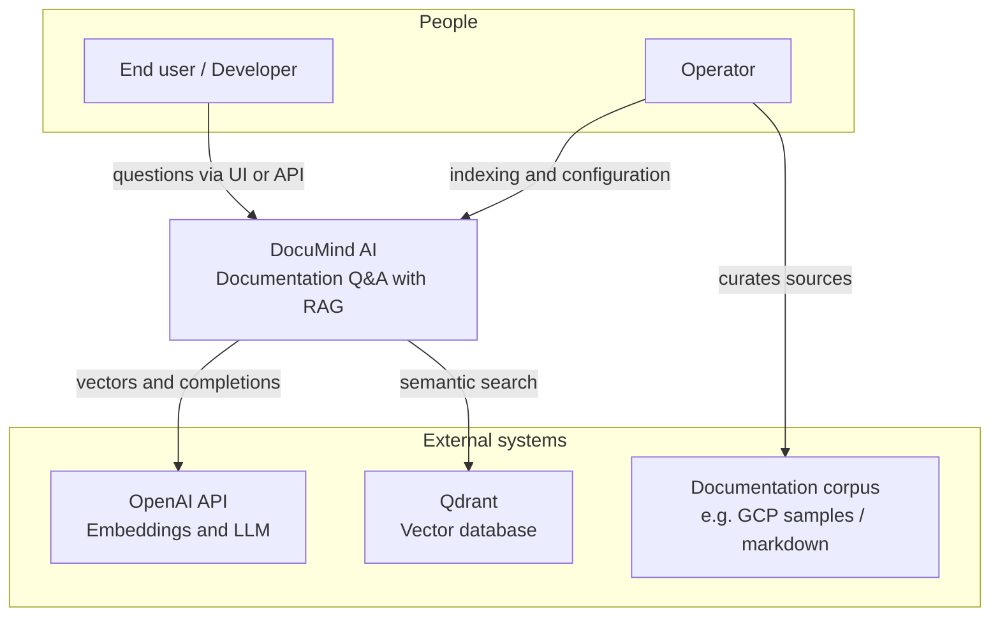
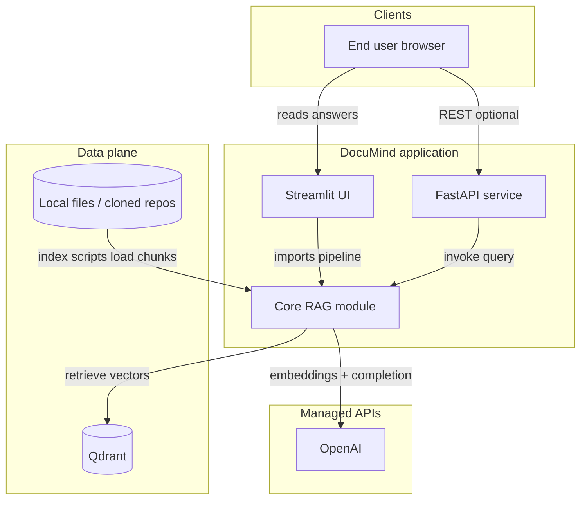
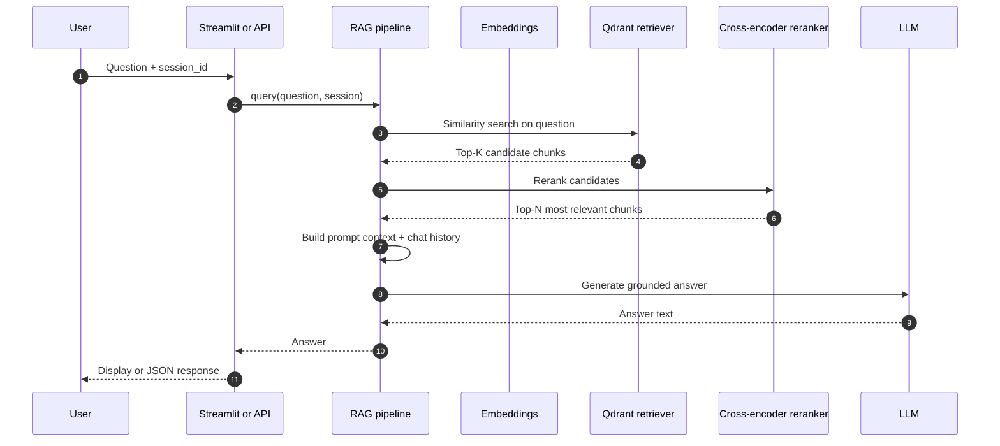
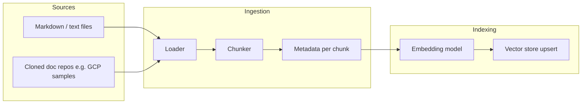
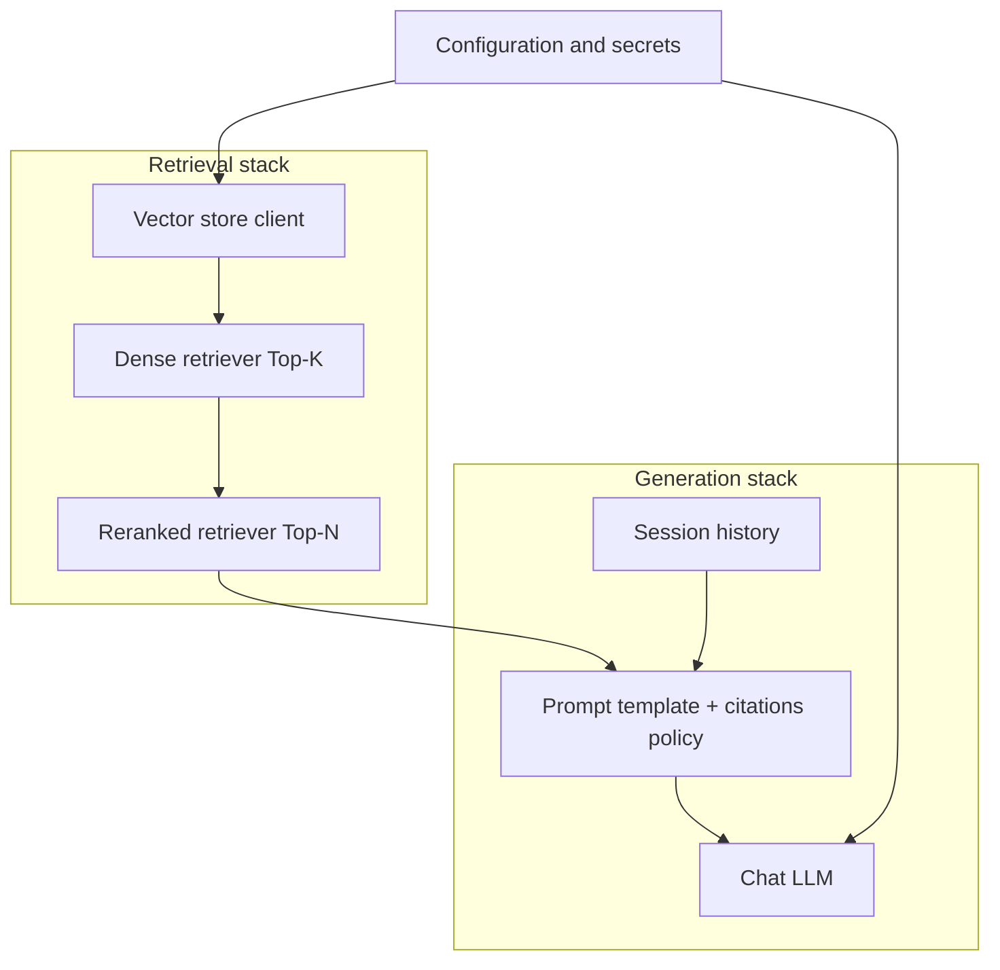
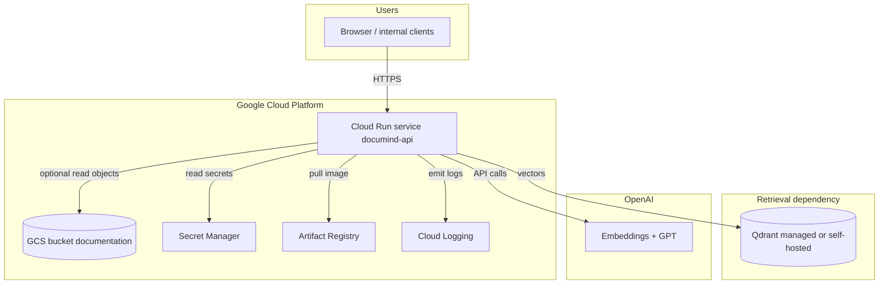
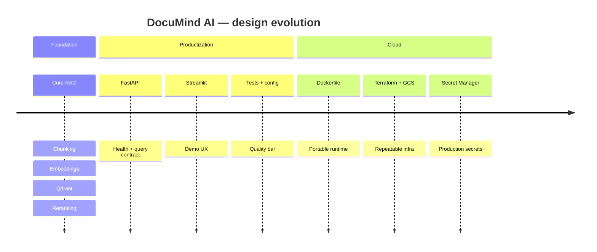

# DocuMind AI — System Design Evolution

This note is written so you can **walk recruiters and hiring managers** through how DocuMind AI works: what problem it solves, how the architecture evolved from a prototype to something production-minded, and why each major piece matters. Technical depth grows section by section; you can stop after any level depending on your audience.

---

## 1. What DocuMind AI is (elevator pitch)

**DocuMind AI** helps people get accurate answers from **technical documentation** instead of searching long pages by hand. Under the hood it uses **Retrieval-Augmented Generation (RAG)**: the system first **finds** the most relevant passages from your docs, then **generates** an answer that is **grounded** in those passages. That reduces hallucination compared to asking a language model alone.

**Why recruiters care:** it shows end-to-end thinking—**data** (documents), **ML/retrieval** (vectors, reranking), **software** (API, UI), and **cloud** (deployability, security, cost)—not just a notebook demo.

---

## 2. How the design evolved (three stages)

| Stage | Focus | What changed |
|--------|--------|----------------|
| **Stage A — Core RAG** | Prove value on a laptop | Documents → chunks → embeddings → vector DB → retrieve → rerank → answer |
| **Stage B — Product surface** | Make it usable and integratable | FastAPI for partners/automation, Streamlit for demos, structured config and tests |
| **Stage C — Cloud-ready** | Operate like a real service | Container image, Google Cloud Run, GCS for document storage, Secret Manager for keys, Terraform for repeatability |

The diagrams below mirror this evolution from **concept** → **runtime architecture** → **detailed flows** → **GCP target**.

---

## 3. Stage A — System context (who talks to whom)

This is the **highest-level** picture: actors, DocuMind, and external services you depend on.

### How to explain this diagram

| Element | Role | Why it matters |
|--------|------|----------------|
| **End user** | Consumes answers | Demonstrates clear product value—not only a model experiment. |
| **Operator / you** | Feeds docs and monitors | Shows awareness of **MLOps** and **lifecycle**: ingestion is ongoing, not one-off. |
| **DocuMind AI** | Your system boundary | Keeps accountability clear: orchestration and quality live here; models are delegated. |
| **OpenAI** | Embeddings + LLM | **Embeddings** turn text into searchable vectors; the **LLM** writes fluent answers conditioned on retrieved context. |
| **Qdrant** | Vector store | Fast **nearest-neighbor search** over millions of chunks; critical for latency and scalability. |
| **Corpus** | Trust boundary for truth | RAG quality is capped by **what you index**; this is the “single source of truth” for grounded answers. |

---

## 4. Stage B — Containers (what actually runs)

This is the **local or single-VPC style** deployment: logical services and how they connect.

### How to explain this diagram

| Component | Role | Why it matters |
|-----------|------|----------------|
| **Streamlit UI** | Quick, honest **product demo** surface | Lets non-developers try the system; good for interviews and stakeholder reviews. |
| **FastAPI** | **Machine-readable** interface | Enables mobile apps, internal tools, Slack bots, or batch jobs to call DocuMind without the UI. |
| **Core RAG module** | Single place for retrieval + generation logic | Avoids duplicating behavior between UI and API—**one brain, many faces**. |
| **Qdrant** | Vector index | Separates **search** from **generation** so you can scale or swap the database without rewriting prompts. |
| **File / repo sources** | Raw documentation | Where truth starts; indexing turns this into **searchable knowledge**. |
| **OpenAI** | Model provider | Keeps state-of-the-art language quality while your product focuses on **retrieval and safety**. |

---

## 5. Query path — sequence (what happens on one question)

Use this when someone asks: *“Walk me through a single request.”*

### How to explain this diagram

| Step | What happens | Why it matters |
|------|----------------|----------------|
| 1 | User asks via UI or API | Same pipeline for humans and integrations. |
| 2–3 | **Vector retrieval** in Qdrant | Surfaces *semantically* related chunks, not just keyword matches. |
| 4–5 | **Reranking** | A second, heavier model scores *query–passage* fit; improves **precision** of what the LLM sees. |
| 6 | **Prompt assembly** + **memory** | Grounding + optional **session context** for follow-up questions. |
| 7–8 | **LLM generation** | Produces natural language while instructions push **citations and honesty** when context is missing. |

**Recruiter-friendly line:** *“We don’t let the model guess from memory alone—we force it to read the best few paragraphs we retrieved first.”*

---

## 6. Indexing path — offline / batch (how knowledge gets in)

Use this to show you understand **data pipelines**, not only online inference.

### How to explain this diagram

| Component | Role | Why it matters |
|-----------|------|----------------|
| **Loader** | Reads files from disk or later from **GCS** | Production systems ingest from buckets, CMS exports, or git—not only local folders. |
| **Chunker** | Splits long docs into **overlapping windows** | Balances **context** (enough to answer) vs **noise** (too much irrelevant text hurts answers and cost). |
| **Embeddings** | Turns each chunk into a vector | Makes text **searchable by meaning**. |
| **Vector store upsert** | Writes/updates Qdrant | Keeps the index **fresh** when docs change—this is your **retrieval SLA** surface. |

---

## 7. Internal RAG composition (building blocks inside the “brain”)

This matches how the code is split: configuration, retrieval, reranking, prompting, generation.

### How to explain this diagram

| Piece | Role | Why it matters |
|-------|------|----------------|
| **Configuration** | Centralizes models, URLs, collection names | **Security** (no keys in code), **environment parity** (local vs staging vs prod). |
| **Dense retriever** | First-stage recall | High **recall**—cast a wide net so reranking has enough candidates. |
| **Reranker** | Second-stage precision | Improves **answer quality**; common pattern in hiring-bar RAG systems. |
| **Prompt + policy** | Tells the model to cite sources and admit ignorance | Mitigates **hallucination** and builds user trust—important in enterprise narratives. |
| **Session memory** | Remembers recent turns **per session** | Supports follow-ups (“elaborate on that”) without re-sending entire threads blindly. |

---

## 8. Stage C — Target GCP architecture (Terraform + Cloud Run + GCS)

This is where you explain **deployment and operations**: how DocuMind looks as a managed service aligned with Datatonic’s GCP footprint.

### How to explain this diagram

| Component | Role | Why it matters |
|-----------|------|----------------|
| **Cloud Run** | Serverless containers, autoscaling | Pay per use, fast iteration, **Ops-light** suitable for demos and many production APIs. |
| **Artifact Registry** | Stores **versioned Docker images** | Reproducible deploys—same image across dev/stage/prod. |
| **GCS** | Durable **document store** | Decouples storage from compute; fits **batch indexing** and compliance-friendly retention. |
| **Secret Manager** | API keys and Qdrant credentials | **Least privilege** and audit trail vs environment variables in plaintext configs. |
| **Cloud Logging** | Centralized logs and errors | Interview talking point: **observability** for latency, failures, and cost debugging. |
| **Qdrant** | Still a dedicated vector engine | Cloud Run hosts the **stateless** API; vectors often live on a **specialized** store or managed offering. |

**Optional sound bite:** *“The API scales on Cloud Run; the corpus scales on GCS; the vector index stays on a store built for nearest-neighbor search.”*

---

## 9. Evolution timeline (how you tell the story in order)

Use this as a **30-second arc**: *foundation → product → cloud*.

---

## 10. Interview talking points (tie design to business outcomes)

1. **Grounding** — Retrieval limits what the model is allowed to treat as fact; fewer “made up” APIs and version numbers.  
2. **Quality vs cost** — Two-stage retrieval (wide then rerank) balances **accuracy** with **token cost** and latency.  
3. **Separation of concerns** — UI does not own business logic; API and core module stay aligned.  
4. **Operability** — Logs, secrets, and IaC show you think beyond model accuracy to **how teams run software**.  
5. **Extensibility** — Hybrid keyword search, Cohere rerank, or Vertex-based indexing are natural next steps without redrawing the whole map.

---

## 11. Document map (where this lives in the repo)

| Artifact | Purpose |
|----------|---------|
| `README.md` | Quick start and commands |
| `CLAUDE.md` | Deep blueprint and interview checklist |
| `GCP_deployment_guide.docx` | Terraform-oriented GCP steps |
| `DocumindAI_System_Design.md` | This doc — **recruiter-oriented design evolution** |

---

*You can present sections 1–4 in five minutes, add section 5–7 for technical depth, and close with section 8 for GCP and Datatonic alignment.*
