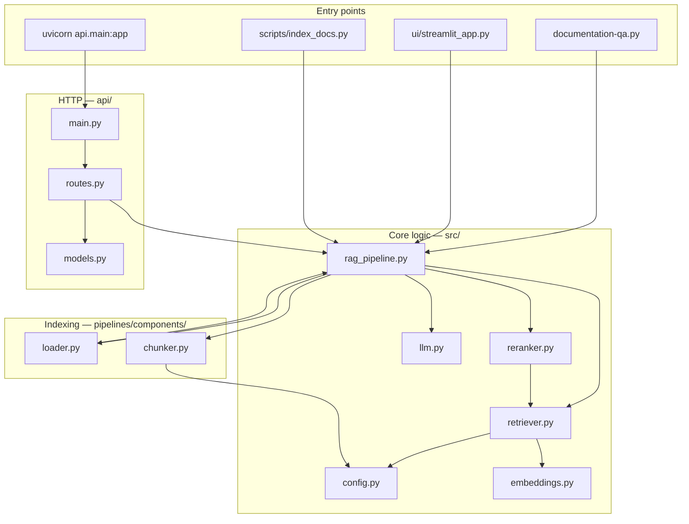
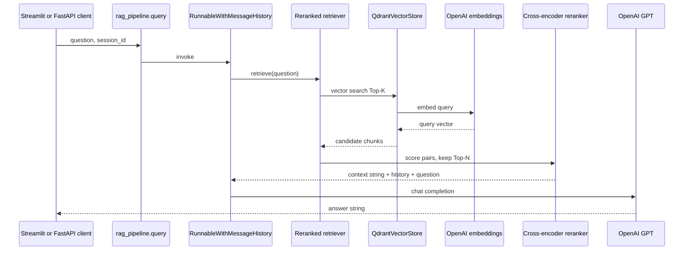
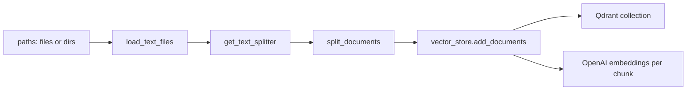

# DocuMind AI — Codebase explanation (interview study guide)

Use this file to **map the repository in your head**: what each folder does, how data flows, and which file to mention when an interviewer asks “where is X implemented?”

---

## 1. One-sentence summary

**DocuMind AI** is a **RAG application**: it **indexes** documentation into **Qdrant** (via OpenAI embeddings), then on each **question** it **retrieves** relevant chunks, **reranks** them, and **generates** an answer with **OpenAI GPT** using LangChain. The same core logic is exposed through **Streamlit** and **FastAPI**.

---

## 2. Repository map (mental diagram)



**How to say it in an interview:** *“Entry points are thin. All retrieval and generation orchestration lives in `rag_pipeline.py`. Small factories in `embeddings`, `llm`, `retriever`, and `reranker` keep configuration and testing clean.”*

---

## 3. Directory-by-directory tour

| Path | Purpose |
|------|---------|
| **`src/`** | Application core: settings, clients, RAG chain, indexing helpers used by scripts/API/UI. |
| **`api/`** | FastAPI app: HTTP routes, Pydantic request/response models. |
| **`pipelines/`** | Reusable **ingestion** pieces (load, chunk) and a placeholder for future Vertex/batch pipelines. |
| **`ui/`** | Streamlit demo that calls `query()` directly. |
| **`scripts/`** | CLIs: index docs, download sample corpus, generate GCP Word doc. |
| **`tests/`** | Pytest: chunking/loader, API health, skipped full RAG integration. |
| **`terraform/`** | Stub for IaC; full snippets live in `GCP_deployment_guide.docx` / your merge. |
| **Root** | `Dockerfile`, `docker-compose.yml` (Qdrant), `requirements.txt`, `.env.example`, design docs. |

---

## 4. `src/` — the heart of the system

### 4.1 `config.py` — single source of configuration

- **`Settings`** (Pydantic `BaseSettings`) loads **environment variables** and optional **`.env`**.
- **`get_settings()`** is **`lru_cache`d** so you do not re-parse env on every call.
- Important fields: `OPENAI_API_KEY`, `QDRANT_URL`, `COLLECTION_NAME`, chunk sizes, `top_k`, `rerank_top_n`, `cross_encoder_model`, optional `GCS_BUCKET_DOCS` for later GCP.

```9:50:src/config.py
class Settings(BaseSettings):
    model_config = SettingsConfigDict(
        env_file=".env",
        env_file_encoding="utf-8",
        extra="ignore",
    )

    cloud_provider: str = "gcp"
    collection_name: str = Field(default="docs-index", validation_alias="COLLECTION_NAME")
    # ... embedding_model, llm_model, chunk_size, top_k, rerank_top_n, cross_encoder_model ...

@lru_cache
def get_settings() -> Settings:
    return Settings()
```

**Interview line:** *“Config is typed and env-driven so the same code runs locally and on Cloud Run with different secrets.”*

---

### 4.2 `embeddings.py` and `llm.py` — thin factories

Both wrap LangChain’s OpenAI integrations with values from `Settings`.

```8:10:src/embeddings.py
def get_embeddings(settings: Settings | None = None) -> OpenAIEmbeddings:
    s = settings or get_settings()
    return OpenAIEmbeddings(model=s.embedding_model)
```

```8:14:src/llm.py
def get_llm(settings: Settings | None = None) -> ChatOpenAI:
    s = settings or get_settings()
    return ChatOpenAI(
        model=s.llm_model,
        temperature=s.temperature,
        max_tokens=s.max_tokens,
    )
```

**Why separate files:** swapping models (e.g. `gpt-4o-mini`) or embedding dimensions touches one place only.

---

### 4.3 `retriever.py` — Qdrant + dense retrieval

- Builds **`QdrantClient`** from URL and optional API key.
- Wraps it in **`QdrantVectorStore`** with **cosine** distance and the shared **embeddings** model.
- **`get_base_retriever`** returns a LangChain retriever with **`similarity`** search and **`k = top_k`** (default 8).

```18:36:src/retriever.py
def get_vector_store(settings: Settings | None = None) -> QdrantVectorStore:
    s = settings or get_settings()
    client = get_qdrant_client(s)
    embeddings = get_embeddings(s)
    return QdrantVectorStore(
        client=client,
        collection_name=s.collection_name,
        embedding=embeddings,
        distance="COSINE",
    )

def get_base_retriever(settings: Settings | None = None):
    s = settings or get_settings()
    vs = get_vector_store(s)
    return vs.as_retriever(
        search_type="similarity",
        search_kwargs={"k": s.top_k},
    )
```

**Interview line:** *“First stage is dense vector search—high recall, not necessarily perfect ordering.”*

---

### 4.4 `reranker.py` — second-stage precision

- Uses **`langchain_classic`**’s **`ContextualCompressionRetriever`** + **`CrossEncoderReranker`**.
- Base retriever = dense Qdrant retriever; **cross-encoder** scores *query–document* pairs and keeps **`top_n`** (default 5).
- Model default: **`cross-encoder/ms-marco-MiniLM-L-6-v2`** (Hugging Face), overridable via **`CROSS_ENCODER_MODEL`**.

```11:23:src/reranker.py
def get_reranked_retriever(settings: Settings | None = None):
    s = settings or get_settings()
    base = get_base_retriever(s)
    model = HuggingFaceCrossEncoder(model_name=s.cross_encoder_model)
    compressor = CrossEncoderReranker(model=model, top_n=s.rerank_top_n)
    return ContextualCompressionRetriever(
        base_compressor=compressor,
        base_retriever=base,
    )
```

**Interview line:** *“Reranking is a common production pattern: cast a wide net with vectors, then use a heavier model to pick the best passages for the LLM context window.”*

---

### 4.5 `rag_pipeline.py` — orchestration, memory, indexing

This is the file you will reference most often.

**A) `format_docs`** — concatenates retrieved chunk text into one string for the prompt.

**B) `build_rag_chain`** — LangChain **LCEL-style** pipeline:

1. **`RunnableParallel`** takes the input dict (must include `question` and, when using history, `chat_history`).
2. Branch **`context`**: `question` → **retriever** (already reranked) → **`format_docs`**.
3. Other branches pass **`question`** and **`chat_history`** through.
4. Then **chat prompt** (system + history placeholder + human) → **LLM** → **string output**.

```52:63:src/rag_pipeline.py
    return (
        RunnableParallel(
            {
                "context": itemgetter("question") | retriever | format_docs,
                "question": itemgetter("question"),
                "chat_history": itemgetter("chat_history"),
            }
        )
        | prompt
        | model
        | StrOutputParser()
    )
```

**C) Session memory** — `_store` maps **`session_id`** → **`InMemoryChatMessageHistory`**. **`RunnableWithMessageHistory`** injects `chat_history` so follow-up questions can use prior turns (same `session_id`).

**D) Performance note** — **`_rag_with_history_default`** caches the default chain so the **cross-encoder model is not reloaded** on every request.

**E) `index_documents`** — uses **`load_text_files`** → **`get_text_splitter`** → **`get_vector_store(...).add_documents(chunks)`** (embeddings happen inside LangChain/Qdrant integration).

**F) `query`** — public function: **`get_rag_chain_with_history`**.invoke with **`configurable.session_id`**.

```117:124:src/rag_pipeline.py
def query(question: str, session_id: str = "default", settings: Settings | None = None) -> str:
    s = settings or get_settings()
    rag = get_rag_chain_with_history(s)
    return rag.invoke(
        {"question": question},
        config={"configurable": {"session_id": session_id}},
    )
```

---

## 5. `pipelines/components/` — ingestion building blocks

### 5.1 `loader.py`

- Accepts **file paths or directories**.
- For directories, globs **`*.md`** and **`*.txt`**, uses LangChain **`TextLoader`**.

**Gap to mention if asked:** PDF or binary formats are not implemented here; you would add loaders or a parsing service.

### 5.2 `chunker.py`

- **`RecursiveCharacterTextSplitter`** with **`chunk_size`**, **`chunk_overlap`**, and **separator priority** (paragraphs, lines, sentences, etc.) — matches common RAG practice for technical docs.

### 5.3 `embedder.py`

- Re-exports **`get_embeddings()`** for pipeline symmetry; **Vertex batch embed** could plug in here later.

### 5.4 `pipelines/indexing_pipeline.py`

- Placeholder **`NotImplementedError`** — signals future **Vertex AI Pipelines** / scheduled jobs.

---

## 6. `api/` — HTTP surface

```7:13:api/main.py
app = FastAPI(
    title="DocuMind AI",
    description="Documentation RAG API",
    version="0.1.0",
)
app.include_router(router)
```

- **`models.py`** — **`QueryRequest`** (`question`, `session_id`), **`QueryResponse`**, **`HealthResponse`**.
- **`routes.py`** — **`GET /health`**, **`POST /api/v1/query`** which **imports `query` inside the handler** to avoid heavy imports at startup (minor pattern).

**Interview line:** *“The API is a thin wrapper—business logic stays in `src` so we do not fork behavior between Streamlit and FastAPI.”*

---

## 7. `ui/streamlit_app.py`

- Ensures repo root on **`sys.path`**.
- Minimal form: question, session id, button → **`rag_pipeline.query`**.
- Warns if **`OPENAI_API_KEY`** missing (`Settings` still loads from `.env` via pydantic-settings for the pipeline when present; the UI check is an extra explicit hint).

---

## 8. `scripts/`

| Script | Role |
|--------|------|
| **`index_docs.py`** | Parses CLI args; builds **`Settings()`** (optional `--collection`); calls **`index_documents`**. |
| **`download_gcp_docs.py`** | Shallow **`git clone`** of `GoogleCloudPlatform/python-docs-samples` into `data/raw/`. |
| **`build_gcp_deployment_docx.py`** | Generates **`GCP_deployment_guide.docx`** via `python-docx`. |

---

## 9. Tests

- **`test_retrieval.py`** — splitter produces multiple chunks from a long doc; loader reads a markdown file from a temp dir.
- **`test_api.py`** — **`GET /health`** returns 200.
- **`test_rag_pipeline.py`** — integration test **skipped** until keys + Qdrant + data exist.

---

## 10. End-to-end flows (diagrams)

### 10.1 Query flow (online)



### 10.2 Indexing flow (offline / CLI)



---

## 11. Deployment-related files

- **`Dockerfile`** — Python 3.11 slim; installs **`requirements.txt`**; copies **`src`**, **`api`**, **`pipelines`**, **`scripts`**; sets **`PYTHONPATH=/app`**; runs **`uvicorn api.main:app`** on port **8000**.
- **`docker-compose.yml`** — exposes **Qdrant** locally (6333).

**Note:** The container **does not** run Qdrant; production needs Qdrant Cloud, another Cloud Run service, etc.

---

## 12. “Where do I change X?” cheat sheet

| Want to change… | Primary file(s) |
|-----------------|------------------|
| Env var names / defaults | `src/config.py`, `.env.example` |
| Embedding or LLM model | `src/config.py` + factories `embeddings.py`, `llm.py` |
| Chunk size / overlap | `src/config.py`, `pipelines/components/chunker.py` |
| Retrieval K / rerank N | `src/config.py` |
| Reranker model | `CROSS_ENCODER_MODEL` / `config.py` |
| System prompt | `src/rag_pipeline.py` (`ChatPromptTemplate`) |
| Qdrant collection / URL | `.env`, `src/retriever.py` |
| HTTP paths / schemas | `api/routes.py`, `api/models.py` |
| Add PDF loading | New loader in `pipelines/components/loader.py` or dedicated module |
| Add hybrid BM25 | New retriever composition in `src/retriever.py` or sibling module + ensemble |

---

## 13. Suggested talking order (60–90 seconds)

1. **Problem:** grounded doc Q&A → RAG.  
2. **Data path:** ingest → chunk → embed → Qdrant.  
3. **Query path:** embed question → dense search → rerank → prompt → GPT.  
4. **Code structure:** thin API/UI → `rag_pipeline` → small modules.  
5. **Production:** Dockerfile + GCP doc (secrets, GCS, Cloud Run) + observability next.

---

## 14. Related documents

| File | Use |
|------|-----|
| `README.md` | Commands and setup |
| `DocumindAI_System_Design.md` | Diagrams + recruiter narrative |
| `CLAUDE.md` | Full blueprint / checklist |
| `GCP_deployment_guide.docx` | Terraform-oriented GCP steps |

---

*Study tip: trace one `query()` call with your IDE (“Go to definition”) from `routes.py` or `streamlit_app.py` through `rag_pipeline.py` into `retriever.py` / `reranker.py` once before the interview.*
